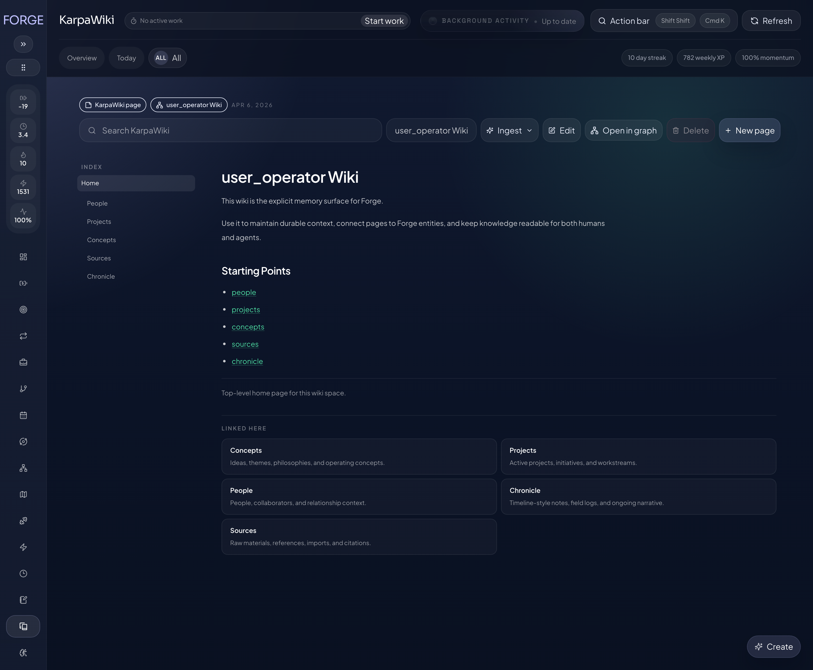
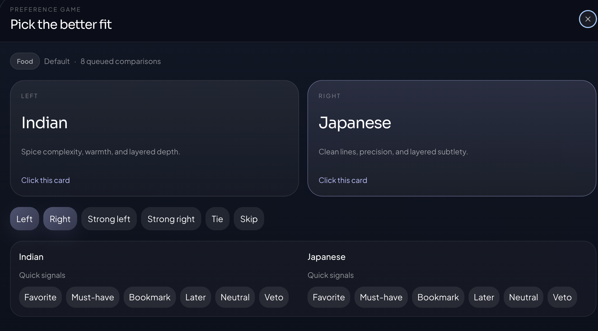

# Forge

[](https://react.dev/)
[](https://www.typescriptlang.org/)
[](https://fastify.dev/)
[](https://albertbuchard.github.io/forge/)

Forge is a local-first planning, execution, memory, and reflection system. It combines a React web app, a Fastify API, a file-first wiki, health surfaces, and curated agent adapters for OpenClaw, Hermes, and Codex.

- Docs: [Forge docs](https://albertbuchard.github.io/forge/)
- Product reference: [Feature reference](https://albertbuchard.github.io/forge/features.html)
- Integration and API reference: [Reference docs](https://albertbuchard.github.io/forge/reference.html)
- OpenClaw package: [`openclaw-plugin/`](./openclaw-plugin)
- Hermes package: [`plugins/forge-hermes/`](./plugins/forge-hermes)


## Getting Started

### OpenClaw

```bash
openclaw plugins install forge-openclaw-plugin
openclaw plugins enable forge-openclaw-plugin
node -e 'const fs=require("fs"); const p=process.env.HOME+"/.openclaw/openclaw.json"; const j=JSON.parse(fs.readFileSync(p,"utf8")); j.plugins ??= {}; j.plugins.allow = Array.from(new Set([...(j.plugins.allow || []), "forge-openclaw-plugin"])); fs.writeFileSync(p, JSON.stringify(j, null, 2)+"\n");'
openclaw gateway restart
openclaw forge health
```

If the plugin is installed but does not load, the missing piece is usually `plugins.allow`. The full setup and runtime notes are in the [reference docs](https://albertbuchard.github.io/forge/reference.html).

Temporary bypass for some OpenClaw `2026.4.x` builds:

Recent OpenClaw versions can block Forge during `plugins install` because Forge launches a local runtime and gets flagged as dangerous by the installer scanner. I am trying to get a cleaner long-term install path upstream. Until then, the reliable bypass is to install the npm package, then load that package path explicitly from `openclaw.json`.

```bash
npm install -g forge-openclaw-plugin
node -e 'const cp=require("child_process"); const fs=require("fs"); const path=require("path"); const p=process.env.HOME+"/.openclaw/openclaw.json"; const j=JSON.parse(fs.readFileSync(p,"utf8")); const pluginPath=path.join(cp.execSync("npm root -g",{encoding:"utf8"}).trim(),"forge-openclaw-plugin"); j.plugins ??= {}; j.plugins.allow = Array.from(new Set([...(j.plugins.allow || []), "forge-openclaw-plugin"])); j.plugins.load ??= {}; j.plugins.load.paths = Array.from(new Set([...(j.plugins.load.paths || []), pluginPath])); j.plugins.entries ??= {}; j.plugins.entries["forge-openclaw-plugin"] = { enabled: true, config: { origin: "http://127.0.0.1", port: 4317, actorLabel: "aurel", timeoutMs: 15000 } }; fs.writeFileSync(p, JSON.stringify(j, null, 2)+"\n"); console.log("Configured", pluginPath);'
openclaw gateway restart
openclaw plugins info forge-openclaw-plugin
openclaw forge health
```

That bypass keeps the normal Forge package, but asks OpenClaw to trust and load the npm-installed folder directly instead of relying on the current installer path.

### Hermes

```bash
~/.hermes/hermes-agent/venv/bin/python -m ensurepip --upgrade
~/.hermes/hermes-agent/venv/bin/python -m pip install --upgrade ./plugins/forge-hermes
```

### Standalone

```bash
npm install
npm run dev
```

The repo dev server commonly serves the UI at `http://127.0.0.1:3027/forge/` and the API at `http://127.0.0.1:4317/api/v1/`.

When Forge is running inside this monorepo, the local runtime now prefers the
tracked shared data root at `/Users/omarclaw/Documents/aurel-monorepo/data/forge`
when it exists, so the app, plugins, and checked-in Forge data stay aligned by
default. Set `FORGE_DATA_ROOT` or an explicit plugin `dataRoot` if you want a
different runtime store.

## What Forge Includes

- goals, projects, tasks, habits, and live task runs
- strategies with directed graph planning
- a file-first wiki with spaces, backlinks, search, background ingest, page deletion, and idempotent ingest review publishing
- preferences with pairwise comparison, direct signals, and concept libraries
- Psyche records such as beliefs, values, patterns, modes, and trigger reports
- sleep and sports records linked back to Forge entities
- multi-user ownership across human and bot users
- OpenClaw, Hermes, and Codex adapter surfaces on top of the same Forge model

## Screenshots

<p align="center">
  
  
</p>

## Documentation

- [Docs home](https://albertbuchard.github.io/forge/) for the short overview and install paths
- [Feature reference](https://albertbuchard.github.io/forge/features.html) for product surfaces and screenshots
- [Reference docs](https://albertbuchard.github.io/forge/reference.html) for runtime surfaces, API groups, adapters, and repo structure
- [Multi-user and strategy guide](./docs/multi-user-and-strategies.md)
- [Preferences system guide](./docs/preferences-system.md)
- [OpenClaw plugin guide](./docs/openclaw-plugin.md)
- [Hermes plugin guide](./docs/hermes-plugin.md)

## Repository Layout

- [`src/`](./src) contains the Forge web app
- [`server/`](./server) contains the Fastify API and data layer
- [`openclaw-plugin/`](./openclaw-plugin) contains the published OpenClaw package and GitHub Pages site
- [`plugins/forge-hermes/`](./plugins/forge-hermes) contains the Hermes package
- [`plugins/forge-codex/`](./plugins/forge-codex) contains the repo-local Codex adapter

## Development

```bash
npm run dev
npx tsc --noEmit
npm run test
node --import tsx --test --test-concurrency=1 server/src/*.test.ts
node --import tsx scripts/dedupe-wiki-pages.ts --apply
```

Forge is served under `/forge/`, so local and shared dev setups should preserve that base path.
