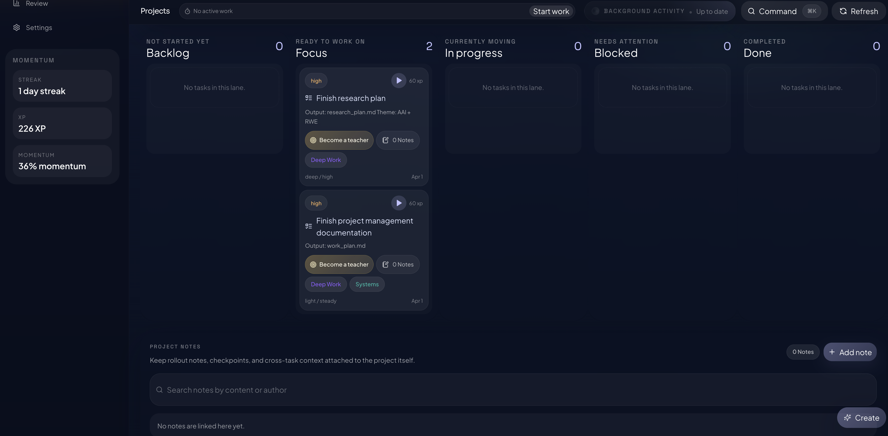
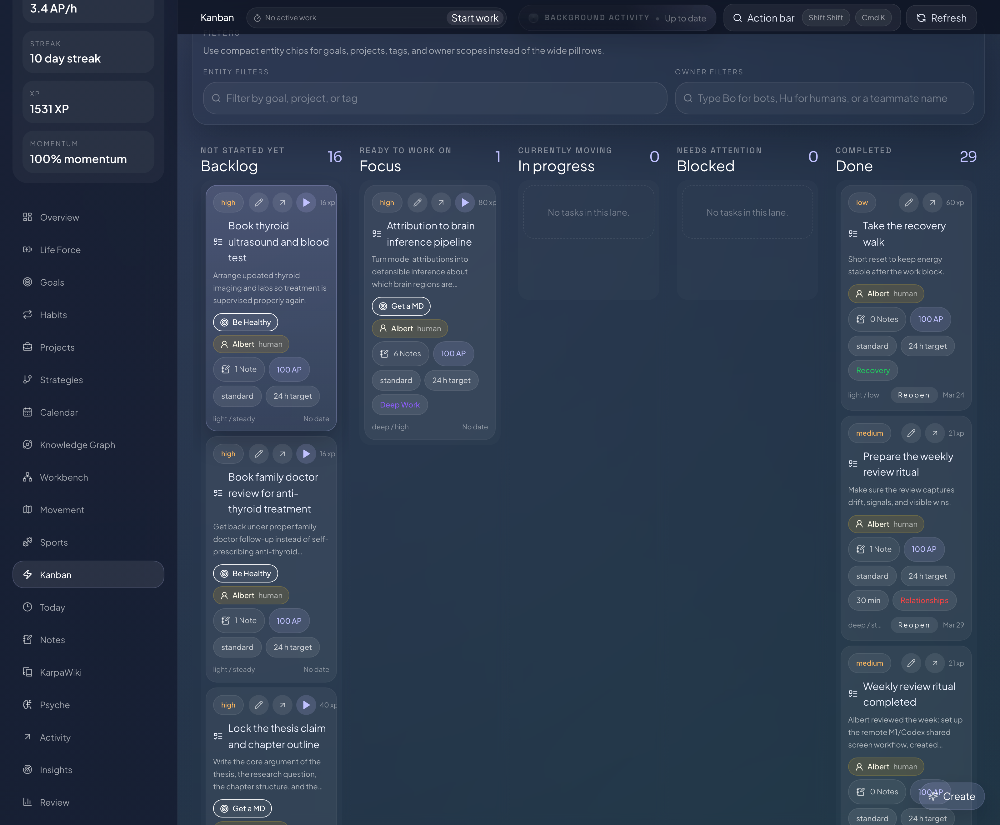
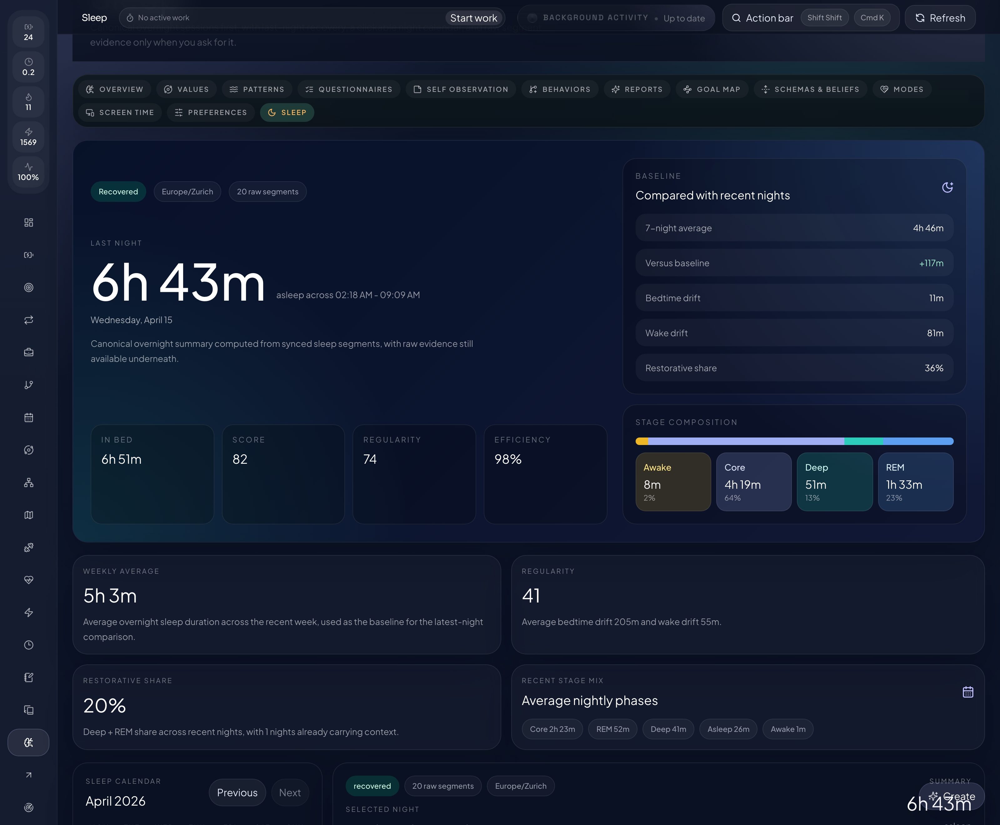

# Forge

[](https://react.dev/)
[](https://www.typescriptlang.org/)
[](https://fastify.dev/)
[](https://www.sqlite.org/)
[](https://tauri.app/)
[](https://www.openapis.org/)
[](https://albertbuchard.github.io/forge/)

Forge is a local-first workspace for planning, execution, memory, health context, and agent collaboration.


It gives you one place to:

- turn goals into strategies, projects, issues, tasks, and subtasks
- run a mixed Kanban board and a compact hierarchy view
- keep notes, wiki pages, preferences, Psyche records, sleep, workouts, and movement context beside the work they explain
- let OpenClaw, Hermes, Codex, the browser app, and the iPhone companion use the same local Forge runtime
- keep the database local by default, with optional explicit data folders and backups in `Settings -> Data`

Forge is built with React 19, TypeScript 5.x, Vite 6, Tailwind CSS 4, Fastify 5, SQLite, generated OpenAPI, Tauri 2, OpenClaw, Hermes, Codex MCP, and a Swift iPhone companion.

## Start Here

### Use Forge From OpenClaw

This is the normal install for most users. The OpenClaw plugin installs Forge's agent tools and can start the bundled local Forge web app for you.

```bash
openclaw plugins install --dangerously-force-unsafe-install forge-openclaw-plugin
openclaw plugins enable forge-openclaw-plugin
openclaw gateway restart
openclaw forge health
openclaw forge ui
```

Why the install flag exists: tested on OpenClaw `2026.5.4`, plain `openclaw plugins install forge-openclaw-plugin` is blocked by the plugin scanner because Forge contains local runtime startup helpers. The documented command uses OpenClaw's explicit approval flag and installs without the old config-edit workaround. The source is public in this repository, and the package is `forge-openclaw-plugin` on npm.

After install, the usual local addresses are:

- Web app: `http://127.0.0.1:4317/forge/`
- API: `http://127.0.0.1:4317/api/v1/`
- OpenAPI: `http://127.0.0.1:4317/api/v1/openapi.json`

If the installer on an older OpenClaw build does not support the flag, use the manual npm fallback in [`openclaw-plugin/README.md`](./openclaw-plugin/README.md#manual-fallback-for-older-openclaw-builds).

### Run The Source App Locally

Use this when you are developing Forge itself.

```bash
npm install
npm run dev
```

Open Forge through the backend URL:

```text
http://127.0.0.1:4317/forge/
```

Vite may also run on `3027` during development, but the stable app entrypoint is still the backend mount on `4317`.

### Install The Local OpenClaw Plugin While Developing

From the Forge repo root:

```bash
openclaw plugins install --link --dangerously-force-unsafe-install ./openclaw-plugin
openclaw plugins enable forge-openclaw-plugin
openclaw gateway restart
openclaw plugins inspect forge-openclaw-plugin
openclaw forge health
```

Use `--link` when you want OpenClaw to use this checkout directly. Omit `--link` when you want to test a copied package install.

### Hermes

Use the published PyPI package when you want Hermes to load the released plugin:

```bash
~/.hermes/hermes-agent/venv/bin/python -m ensurepip --upgrade
~/.hermes/hermes-agent/venv/bin/python -m pip install --upgrade pip
~/.hermes/hermes-agent/venv/bin/python -m pip install --upgrade forge-hermes-plugin
```

Use this from the Forge repo instead when you want Hermes to follow local source edits:

```bash
~/.hermes/hermes-agent/venv/bin/python -m ensurepip --upgrade
~/.hermes/hermes-agent/venv/bin/python -m pip install --upgrade pip
~/.hermes/hermes-agent/venv/bin/python -m pip install --upgrade --editable ./plugins/forge-hermes
```

### Codex

Codex uses the Forge MCP bridge from this repo:

```bash
codex mcp add forge \
  --env FORGE_ORIGIN=http://127.0.0.1 \
  --env FORGE_PORT=4317 \
  --env FORGE_ACTOR_LABEL=codex \
  --env FORGE_TIMEOUT_MS=15000 \
  -- /bin/zsh /absolute/path/to/forge/plugins/forge-codex/scripts/run-mcp.sh
codex mcp list
```

## What Forge Covers

- planning and execution: goals, strategies, projects, issues, tasks, subtasks, task runs, and habits
- memory: notes, wiki pages, search, ingest, backlinks, and linked Forge context
- reflection: preferences, Psyche values, behavior patterns, beliefs, modes, and trigger reports
- health: sleep nights, workouts, movement history, and iPhone HealthKit import
- collaboration: explicit human and bot users, owner/assignee filters, agent sessions, and audited actions
- progress: XP, levels, streaks, trophies, optional downloadable art packs, and local reward history

## Data Location And Backups

By default, local plugin installs store Forge data under `~/.forge`. You can choose another folder by setting `dataRoot` in the plugin config or by using `Settings -> Data` in the web app.

If OpenClaw, Hermes, Codex, and the browser should share one Forge system, point them at the same origin, port, and data root. Before moving or merging data folders, back up every candidate `forge.sqlite` and verify which database the live runtime has opened.

## Screenshots

| Surface | Screenshot |
| --- | --- |
| Projects |  |
| Execution board |  |
| Knowledge and memory |  |
| Sleep and health |  |

## Documentation

- Docs home: [albertbuchard.github.io/forge](https://albertbuchard.github.io/forge/)
- Features: [albertbuchard.github.io/forge/features.html](https://albertbuchard.github.io/forge/features.html)
- Integrations: [albertbuchard.github.io/forge/integrations.html](https://albertbuchard.github.io/forge/integrations.html)
- API reference: [albertbuchard.github.io/forge/api/](https://albertbuchard.github.io/forge/api/)
- Repo docs: [`docs/`](./docs)

## Contributor Checks

```bash
npx tsc --noEmit
npm run test
npm run test:server
```

Contributor and runtime details live in the [Development guide](https://albertbuchard.github.io/forge/development.html) and [Engineering reference](https://albertbuchard.github.io/forge/engineering.html). The publishable OpenClaw package lives in [`openclaw-plugin/`](./openclaw-plugin), the Hermes adapter in [`plugins/forge-hermes/`](./plugins/forge-hermes), and the Codex adapter in [`plugins/forge-codex/`](./plugins/forge-codex).
