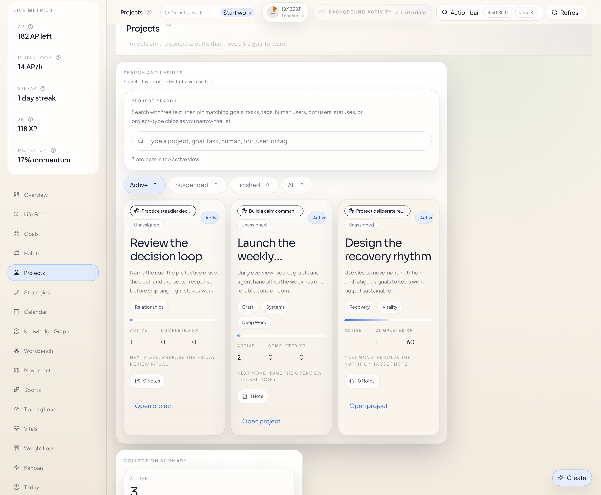
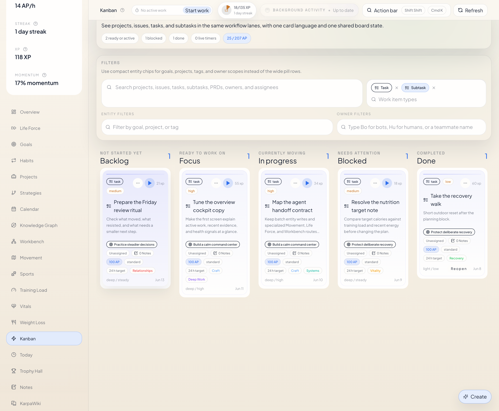
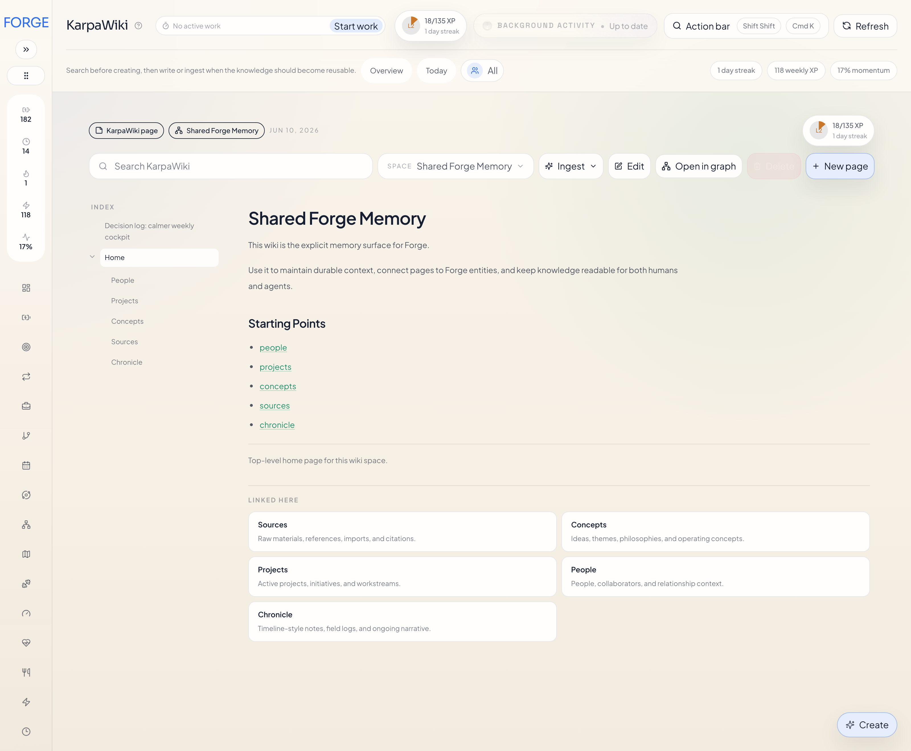

<p align="center">
  
</p>

[](https://react.dev/)
[](https://www.typescriptlang.org/)
[](https://fastify.dev/)
[](https://www.sqlite.org/)
[](https://tauri.app/)
[](https://www.openapis.org/)
[](https://albertbuchard.github.io/forge/)

# Forge

Forge is a local-first app, API, and agent runtime for structured memory.

It stores the parts of work and life that need to stay usable over time: goals, projects,
tasks, notes, wiki pages, Psyche records, preferences, calendar plans, sleep, workouts,
movement, food, Life Events, trusted files, and agent work. The same records are
available in the web app, through the API, and through trusted agent integrations.

Unstructured memory keeps conversations, notes, wiki prose, transcripts, and reasoning
traces. Forge complements it by saving selected things as records you can search, link,
review, schedule, update, embed, restore, and hand back to trusted agents.

Read the full published documentation on the
[Forge GitHub Pages docs](https://albertbuchard.github.io/forge/).

## Table Of Contents

- [Why Forge](#why-forge)
- [How Forge Solves It](#how-forge-solves-it)
- [Install Forge](#install-forge)
- [Run The Source App Locally](#run-the-source-app-locally)
- [Advanced Adapter Setup](#advanced-adapter-setup)
- [Data Location And Backups](#data-location-and-backups)
- [What Forge Covers](#what-forge-covers)
- [Screenshots](#screenshots)
- [Documentation](#documentation)
- [Contributor Checks](#contributor-checks)
- [License](#license)

## Why Forge

Forge gives humans and AI agents the same local system of record.

A user can talk through something in a chat, note, wiki page, or transcript, then save
the part that needs follow-up in Forge. Forge can keep a goal, task, belief, trigger
report, preference, file, calendar block, sleep night, workout, movement pattern, or
agent action connected to the other records around it.

In practical use, Forge lets you save a belief from a conversation, connect a file to a
project, attach a note to a workout, turn a decision into a task, review a trigger
pattern, check preference history, or let an agent read the same context before it acts.

A project can point to its wiki page, files, tasks, decisions, calendar blocks, recovery
context, and agent runs. A Psyche pattern can point to trigger reports, beliefs, notes,
and support flashcards. A trusted file can point to the goal, task, wiki page, note, or
Psyche record it supports.

## How Forge Solves It

Forge runs locally. The browser app, API, OpenClaw, Hermes, Codex, Claude Code, the
iPhone companion, and the watchOS command surface can use the same Forge records when
they are configured together.

In Forge, you can:

- plan work through goals, strategies, projects, issues, tasks, subtasks, habits, task
  runs, work adjustments, completion reports, and linked git refs
- keep notes and wiki pages with backlinks, search, ingest jobs, and links to the
  records they explain
- store Psyche material as values, beliefs, modes, behavior patterns, behaviors, trigger
  reports, emotion definitions, event types, flashcards, questionnaire runs, and
  self-observation notes
- track preferences through catalogs, items, judgments, signals, contexts, comparisons,
  and score updates
- work with calendar events, work block templates, task timeboxes, provider connections,
  sync state, and writable calendar projections
- review sleep, workouts, HealthKit imports, training load, nutrition, weight-loss
  context, movement timelines, places, trips, Life Force, and fatigue signals
- store trusted spreadsheets, documents, PDFs, text, structured text, images, and other
  supported files in the Artifact Store with provenance, scans, danger scores, versions,
  audit events, links, and human downloads
- coordinate human users, bot users, agent runtime sessions, owners, assignees,
  approvals, and audited agent actions
- pin important Forge records and resume true recently viewed records from the Action
  Bar, iPhone companion, watch Inbox, and trusted agent read paths

The work hierarchy is explicit:

```text
Goal -> Strategy -> Project -> Strategy -> Issue -> Task -> Subtask
```

Projects are PRD-backed initiatives. Issues are vertical slices across the stack. Tasks
are one focused AI session each. Subtasks are small child steps. Completion reports can
record the files changed, summarize the work, and link the relevant git refs.

Psyche is a core Forge surface. A conversation can surface a belief, trigger, mode,
value, or behavior pattern; Forge can save it as a record connected to notes, flashcards,
episodes, and future review.

Artifacts are a core Forge surface too. A trusted file can become an Artifact Store
record connected to the Forge records it supports. Agent access stays scoped to trusted
uploads, metadata, scans, enrichment, links, versions, and audit history. Human users get
the download path.

Health, movement, and recovery are part of the same memory graph. Sleep nights, workouts,
training load, nutrition context, places, trips, Life Force, fatigue signals, and movement
timelines can sit beside the decisions, tasks, notes, and Psyche records they help
explain.

The same records are used by the React web app, Fastify API, OpenClaw, Hermes, Codex,
Claude Code, the iPhone companion, and the watchOS command surface. The database stays
local by default, with explicit data-folder and backup controls in `Settings -> Data`.

Forge is built with React 19, TypeScript 5.x, Vite 6, Tailwind CSS 4, Fastify 5,
SQLite, generated OpenAPI, Tauri 2, OpenClaw, Hermes, Codex MCP, Claude Code MCP, a Rust
Iroh companion transport, and a Swift iPhone companion that links the same Rust transport
core natively.

## Install Forge

### Single-command Install

The preferred install for everyone is one guided command:

```bash
npx forge-memory
```

`forge-memory` is the front door for Forge. It installs the local Forge UI/runtime,
discovers OpenClaw, Hermes, Codex, and Claude Code in the background, shows detected host
adapters in a checkbox menu, selects every detected adapter by default, leaves missing
adapters visible as disabled `not found` rows, lets Space toggle adapter choices, and can
pair the iOS companion at the end.

Use the same command whether you want the browser UI, OpenClaw, Hermes, Codex, Claude
Code, or all of them sharing one local Forge memory system.

The installer prepares a per-user local authentication helper. Local adapters use that
helper automatically, so you do not copy or maintain an API key. Open the browser with
`npx forge-memory ui`. On macOS, Forge registers an owner-only local handler and uses a
short public transaction that is bound to an ephemeral key held by that browser. No
session credential is placed in the URL, command arguments, or browser storage. Forge
keeps the resulting renewable local session in an HttpOnly cookie. The separate,
non-authenticating CSRF value stays in same-origin browser storage for the same browser
profile, so new tabs can keep writing without another prompt. A browser that blocks
automatic external-protocol launches receives a pre-staged **Authorize this browser**
link so the owner check starts directly from that explicit click.

Network access does not authorize Forge. A browser or API client that reaches Forge
through Tailscale or another network still needs a Forge-issued scoped credential.
Tailscale Serve can provide private HTTPS transport, but it is an additional network
filter rather than a substitute for Forge authentication. Tailscale Funnel is not
required.

Remote pairing grants normal user-interface and API scopes without repeated prompts.
Forge rejects `machine.*` scopes unless that installation has an operating-system-isolated
worker available and validated; it never falls back to running remote machine work as the
Forge server process.

Development installs use the same flow, but link adapters to this source checkout and
default to the real shared Forge data folder:

```bash
npx forge-memory --dev
```

After install, reopen the full configuration flow with current settings as defaults:

```bash
npx forge-memory configure
```

Useful runtime commands:

```bash
npx forge-memory status
npx forge-memory doctor
npx forge-memory doctor --repair
npx forge-memory update
npx forge-memory ui
npx forge-memory restart
npx forge-memory stop
npx forge-memory export
npx forge-memory uninstall
npx forge-memory pair-ios
```

`doctor --repair` checks the local install, recreates missing local folders, starts or
restarts the runtime when allowed, and prints concrete next steps without deleting Forge
data.

`pair-ios` prefers Tailscale when it is installed, authenticated, and Forge is reachable
through the Mac's MagicDNS HTTPS URL. That gives the iPhone a normal phone-reachable Forge
URL for sync and the embedded WebView. If Tailscale is not available or is declined, Forge
falls back to an Iroh QR with the desktop Iroh node id, pairing token, optional relay hint,
and ALPN `forge-companion/1`. The CLI uses a compact QR and saves the same compact payload
under `~/.forge/pairing/` so you can paste it into the iPhone app if the camera cannot
scan.

Explicit direct HTTP/TCP pairing remains available for deliberate LAN, Tailscale, or
debugging setups. A physical iPhone needs a phone-reachable URL:

```bash
npx forge-memory pair-ios --public-url https://your-mac.tailnet.ts.net/forge/
```

Loopback URLs such as `127.0.0.1` are useful for the iOS Simulator but are rejected for
physical-phone pairing.

The short install path is intentionally the whole base setup. If you want the lower level
networking details, read the companion transport reference in
[`docs/reference/companion-iroh.md`](./docs/reference/companion-iroh.md) or the published
[Companion Transport guide](https://albertbuchard.github.io/forge/companion-transport.html).

`export` creates a portable backup of the real Forge data folder. `uninstall` removes the
Forge Memory runtime manager and cache but keeps the Forge data folder by default; use
`--remove-data` only when you explicitly want to delete the data too. `update` backs up
the Forge data folder when appropriate, refreshes the runtime and selected adapters,
preserves user data, and reports the backup location before making changes.

After install, the usual local addresses are:

- Web app: `http://127.0.0.1:4317/forge/`
- API: `http://127.0.0.1:4317/api/v1/`
- OpenAPI: `http://127.0.0.1:4317/api/v1/openapi.json`

Manual OpenClaw, Hermes, Codex, and Claude Code setup still exists for advanced cases in
[`docs/reference/openclaw-plugin.md`](./docs/reference/openclaw-plugin.md),
[`docs/reference/hermes-plugin.md`](./docs/reference/hermes-plugin.md),
[`plugins/codex/README.md`](./plugins/codex/README.md), and
[`docs/reference/claude-code-adapter.md`](./docs/reference/claude-code-adapter.md).

## Run The Source App Locally

Use this when you are developing Forge itself.

```bash
npm install
npm run dev
```

Open Forge through the backend URL:

```text
http://127.0.0.1:4317/forge/
```

Vite may also run on `3027` during development, but the stable app entrypoint is still
the backend mount on `4317`. Opening the Vite port directly does not bypass Forge
authentication.

## Advanced Adapter Setup

The guided `npx forge-memory` flow is the normal path. Use these commands only for
adapter-specific debugging, local source-linking, or recovery.

### OpenClaw Plugin While Developing

From the Forge repo root:

```bash
openclaw plugins install --link --dangerously-force-unsafe-install ./plugins/openclaw
openclaw plugins enable forge-openclaw-plugin
openclaw gateway restart
openclaw plugins inspect forge-openclaw-plugin --runtime
openclaw forge health
```

Use `--link` when you want OpenClaw to use this checkout directly. Omit `--link` when you
want to test a copied package install.

### Hermes Adapter Commands

Use the published PyPI package when you want Hermes to load the released plugin:

```bash
~/.hermes/hermes-agent/venv/bin/python -m ensurepip --upgrade
~/.hermes/hermes-agent/venv/bin/python -m pip install --upgrade pip
~/.hermes/hermes-agent/venv/bin/python -m pip install --upgrade forge-hermes-plugin
```

Use this from the Forge repo instead when you want Hermes to follow local source edits:

```bash
~/.hermes/hermes-agent/venv/bin/python -m ensurepip --upgrade
~/.hermes/hermes-agent/venv/bin/python -m pip install --upgrade pip
~/.hermes/hermes-agent/venv/bin/python -m pip install --upgrade --editable ./plugins/hermes
```

### Codex MCP Commands

Prefer `npx forge-memory`, which writes the Forge MCP entry through its guided
configuration flow. Codex uses the Forge MCP bridge from this repo:

```bash
codex mcp add forge \
  --env FORGE_ORIGIN=http://127.0.0.1 \
  --env FORGE_PORT=4317 \
  --env FORGE_ACTOR_LABEL=codex \
  --env FORGE_TIMEOUT_MS=15000 \
  -- /bin/zsh /absolute/path/to/forge/plugins/codex/scripts/run-mcp.sh
codex mcp list
```

## Data Location And Backups

By default, local plugin installs store Forge data under `~/.forge`. You can choose
another folder by setting `dataRoot` in the plugin config or by using `Settings -> Data`
in the web app.

If OpenClaw, Hermes, Codex, Claude Code, and the browser should share one Forge system,
point them at the same origin, port, and data root. Before moving or merging data
folders, back up every candidate `forge.sqlite` and verify which database the live runtime
has opened.

## What Forge Covers

- Psyche and reflection: values, beliefs, modes, behavior patterns, behaviors, trigger reports, emotion definitions, event types, flashcards, questionnaire runs, and self-observation
- knowledge memory: notes, wiki pages, search, ingest, backlinks, evidence, and linked Forge context
- artifacts: trusted spreadsheets, documents, PDFs, structured text, text, and images with metadata, provenance, scans, versions, generic entity links, and human-only downloads
- health and body context: sleep nights, workouts, training load, movement history, nutrition and weight-loss context, HealthKit imports, and iPhone sync
- preferences: catalogs, contexts, preference items, judgments, signals, comparisons, and score updates
- calendar and time: native events, Life Events, mirrored calendars, provider connections, work block templates, and task timeboxes
- planning and execution: goals, strategies, projects, issues, tasks, subtasks, task runs, habits, work adjustments, and git-linked completion reports
- agents and collaboration: OpenClaw, Hermes, Codex, Claude Code, explicit human and bot users, owner/assignee filters, runtime sessions, approvals, and audited actions
- progress: XP, levels, streaks, trophies, optional downloadable art packs, and local reward history

## Screenshots

| Surface              | Screenshot                                                                               |
| -------------------- | ---------------------------------------------------------------------------------------- |
| Overview             |  |
| Projects             |          |
| Execution board      |              |
| Knowledge and memory |                |
| Sleep and health     |          |

## Documentation

Start with [`docs/README.md`](./docs/README.md). Durable setup and architecture
references live under [`docs/reference/`](./docs/reference/), release procedures live
under [`docs/release/`](./docs/release/). Private goals, automation reports, audit
handoffs, and conversation-derived planning notes do not belong in this public
repository.

New contributors should also read the
[`Repository Structure`](./docs/reference/repository-structure.md) reference before
moving files or changing release/package boundaries.

- Docs home: [albertbuchard.github.io/forge](https://albertbuchard.github.io/forge/)
- Features: [albertbuchard.github.io/forge/features.html](https://albertbuchard.github.io/forge/features.html)
- Integrations: [albertbuchard.github.io/forge/integrations.html](https://albertbuchard.github.io/forge/integrations.html)
- Companion transport: [albertbuchard.github.io/forge/companion-transport.html](https://albertbuchard.github.io/forge/companion-transport.html)
- API reference: [albertbuchard.github.io/forge/api/](https://albertbuchard.github.io/forge/api/)
- Repo docs: [`docs/`](./docs)

## Contributor Checks

```bash
npx tsc --noEmit
npm run test
npm run test:server
```

Contributor and runtime details live in the
[Development guide](https://albertbuchard.github.io/forge/development.html) and
[Engineering reference](https://albertbuchard.github.io/forge/engineering.html). The
publishable OpenClaw package lives in [`plugins/openclaw/`](./plugins/openclaw), the
Hermes adapter in [`plugins/hermes/`](./plugins/hermes), and the Codex and Claude Code
MCP adapters use Forge Memory's shared MCP entrypoint.

## License

Forge-owned public code is licensed under Apache-2.0. The license is permissive,
commercial-use friendly, and includes an explicit patent grant, which keeps a clean path
for future closed-source commercial Forge forks.
