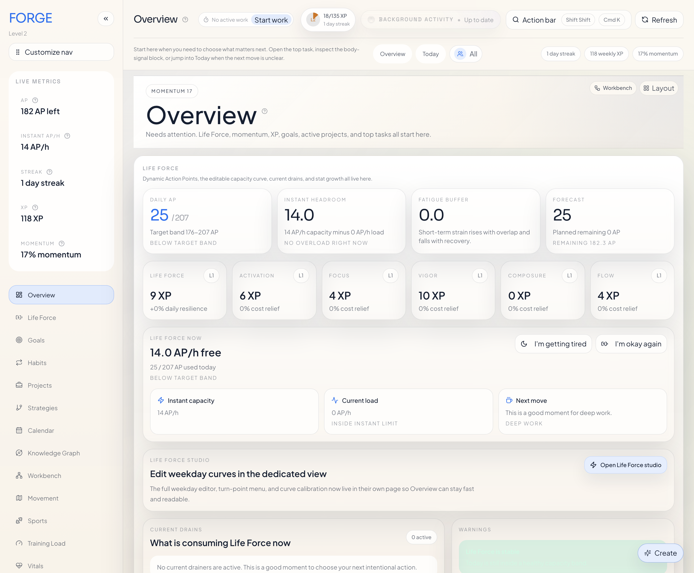
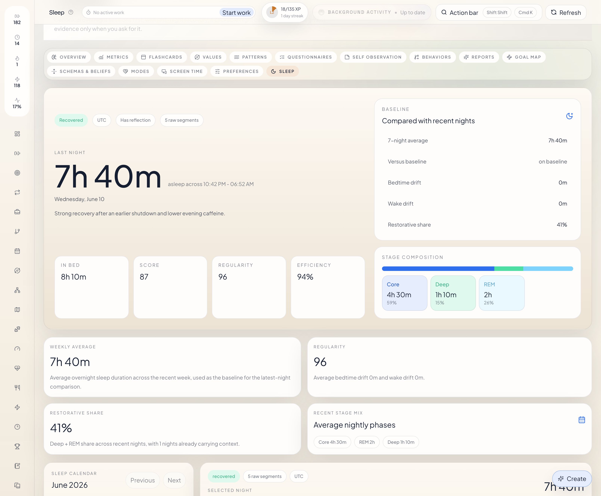

<p align="center">
  
</p>

[](https://react.dev/)
[](https://www.typescriptlang.org/)
[](https://fastify.dev/)
[](https://www.sqlite.org/)
[](https://tauri.app/)
[](https://www.openapis.org/)
[](https://albertbuchard.github.io/forge/)

Forge is a local-first workspace for planning, execution, memory, health context, and agent collaboration.

Read the full published documentation on the [Forge GitHub Pages docs](https://albertbuchard.github.io/forge/).



It gives you one place to:

- turn goals into strategies, projects, issues, tasks, and subtasks
- run a mixed Kanban board and a compact hierarchy view
- keep notes, wiki pages, preferences, Psyche records, sleep, workouts, and movement context beside the work they explain
- let OpenClaw, Hermes, Codex, the browser app, and the iPhone companion use the same local Forge runtime
- keep the database local by default, with optional explicit data folders and backups in `Settings -> Data`

Forge is built with React 19, TypeScript 5.x, Vite 6, Tailwind CSS 4, Fastify 5, SQLite, generated OpenAPI, Tauri 2, OpenClaw, Hermes, Codex MCP, a Rust Iroh companion transport, and a Swift iPhone companion that links the same Rust transport core natively.

## Start Here

### Single-command Install

The preferred install for everyone is one guided command:

```bash
npx forge-memory
```

`forge-memory` is the front door for Forge. It installs the local Forge UI/runtime, discovers OpenClaw, Hermes, and Codex in the background, shows detected host adapters in a checkbox menu, selects every detected adapter by default, leaves missing adapters visible as disabled `not found` rows, lets Space toggle adapter choices, and can pair the iOS companion at the end.

Use the same command whether you want the browser UI, OpenClaw, Hermes, Codex, or all of them sharing one local Forge memory system.

Development installs use the same flow, but link adapters to this source checkout and default to the real shared Forge data folder:

```bash
npx forge-memory --dev
```

After install, reopen the full configuration flow with current settings as defaults:

```bash
npx forge-memory configure
```

Useful runtime commands:

```bash
npx forge-memory status
npx forge-memory doctor
npx forge-memory doctor --repair
npx forge-memory update
npx forge-memory ui
npx forge-memory restart
npx forge-memory stop
npx forge-memory export
npx forge-memory uninstall
npx forge-memory pair-ios
```

`doctor --repair` checks the local install, recreates missing local folders, starts or
restarts the runtime when allowed, and prints concrete next steps without deleting Forge
data.

`pair-ios` prefers Tailscale when it is installed, authenticated, and Forge is reachable
through the Mac's MagicDNS HTTPS URL. That gives the iPhone a normal phone-reachable
Forge URL for sync and the embedded WebView. If Tailscale is not available or is
declined, Forge falls back to an Iroh QR with the desktop Iroh node id, pairing token,
optional relay hint, and ALPN `forge-companion/1`. The CLI uses a compact QR and saves
the same compact payload under `~/.forge/pairing/` so you can paste it into the iPhone
app if the camera cannot scan.

Explicit direct HTTP/TCP pairing remains available for deliberate LAN, Tailscale, or
debugging setups. A physical iPhone needs a phone-reachable URL:

```bash
npx forge-memory pair-ios --public-url https://your-mac.tailnet.ts.net/forge/
```

Loopback URLs such as `127.0.0.1` are useful for the iOS Simulator but are rejected for
physical-phone pairing.

The short install path is intentionally the whole base setup. If you want the lower
level networking details, read the companion transport reference in
[`docs/reference/companion-iroh.md`](./docs/reference/companion-iroh.md) or the published
[Companion Transport guide](https://albertbuchard.github.io/forge/companion-transport.html).

`export` creates a portable backup of the real Forge data folder. `uninstall` removes the Forge Memory runtime manager and cache but keeps the Forge data folder by default; use `--remove-data` only when you explicitly want to delete the data too.
`update` backs up the Forge data folder when appropriate, refreshes the runtime and
selected adapters, preserves user data, and reports the backup location before making
changes.

After install, the usual local addresses are:

- Web app: `http://127.0.0.1:4317/forge/`
- API: `http://127.0.0.1:4317/api/v1/`
- OpenAPI: `http://127.0.0.1:4317/api/v1/openapi.json`

Manual OpenClaw, Hermes, and Codex setup still exists for advanced cases in [`docs/reference/openclaw-plugin.md`](./docs/reference/openclaw-plugin.md), [`docs/reference/hermes-plugin.md`](./docs/reference/hermes-plugin.md), and [`plugins/forge-codex/README.md`](./plugins/forge-codex/README.md).

## License

Forge-owned public code is licensed under Apache-2.0. The license is permissive,
commercial-use friendly, and includes an explicit patent grant, which keeps a clean path
for future closed-source commercial Forge forks.

### Run The Source App Locally

Use this when you are developing Forge itself.

```bash
npm install
npm run dev
```

Open Forge through the backend URL:

```text
http://127.0.0.1:4317/forge/
```

Vite may also run on `3027` during development, but the stable app entrypoint is still the backend mount on `4317`.

### Advanced: Install The Local OpenClaw Plugin While Developing

This is an advanced adapter-only path. Prefer `npx forge-memory --dev` unless you are specifically debugging OpenClaw's plugin installer.

From the Forge repo root:

```bash
openclaw plugins install --link --dangerously-force-unsafe-install ./openclaw-plugin
openclaw plugins enable forge-openclaw-plugin
openclaw gateway restart
openclaw plugins inspect forge-openclaw-plugin --runtime
openclaw forge health
```

Use `--link` when you want OpenClaw to use this checkout directly. Omit `--link` when you want to test a copied package install.

### Advanced: Hermes Adapter Commands

This is an advanced adapter-only path. Prefer `npx forge-memory` for released installs and `npx forge-memory --dev` for source-backed installs.

Use the published PyPI package when you want Hermes to load the released plugin:

```bash
~/.hermes/hermes-agent/venv/bin/python -m ensurepip --upgrade
~/.hermes/hermes-agent/venv/bin/python -m pip install --upgrade pip
~/.hermes/hermes-agent/venv/bin/python -m pip install --upgrade forge-hermes-plugin
```

Use this from the Forge repo instead when you want Hermes to follow local source edits:

```bash
~/.hermes/hermes-agent/venv/bin/python -m ensurepip --upgrade
~/.hermes/hermes-agent/venv/bin/python -m pip install --upgrade pip
~/.hermes/hermes-agent/venv/bin/python -m pip install --upgrade --editable ./plugins/forge-hermes
```

### Advanced: Codex MCP Commands

This is an advanced MCP-only path. Prefer `npx forge-memory`, which writes the Forge MCP entry through its guided configuration flow.

Codex uses the Forge MCP bridge from this repo:

```bash
codex mcp add forge \
  --env FORGE_ORIGIN=http://127.0.0.1 \
  --env FORGE_PORT=4317 \
  --env FORGE_ACTOR_LABEL=codex \
  --env FORGE_TIMEOUT_MS=15000 \
  -- /bin/zsh /absolute/path/to/forge/plugins/forge-codex/scripts/run-mcp.sh
codex mcp list
```

## Documentation

Start with [`docs/README.md`](./docs/README.md). Durable setup and architecture
references live under [`docs/reference/`](./docs/reference/), release procedures live
under [`docs/release/`](./docs/release/), and historical goals, audits, and handoffs
are preserved under [`docs/internal/`](./docs/internal/) so they do not compete with
the current user-facing docs.

## What Forge Covers

- planning and execution: goals, strategies, projects, issues, tasks, subtasks, task runs, and habits
- memory: notes, wiki pages, search, ingest, backlinks, and linked Forge context
- reflection: preferences, Psyche values, behavior patterns, beliefs, modes, and trigger reports
- health: sleep nights, workouts, movement history, and iPhone HealthKit import
- collaboration: explicit human and bot users, owner/assignee filters, agent sessions, and audited actions
- progress: XP, levels, streaks, trophies, optional downloadable art packs, and local reward history

## Data Location And Backups

By default, local plugin installs store Forge data under `~/.forge`. You can choose another folder by setting `dataRoot` in the plugin config or by using `Settings -> Data` in the web app.

If OpenClaw, Hermes, Codex, and the browser should share one Forge system, point them at the same origin, port, and data root. Before moving or merging data folders, back up every candidate `forge.sqlite` and verify which database the live runtime has opened.

## Screenshots

| Surface              | Screenshot                                                                      |
| -------------------- | ------------------------------------------------------------------------------- |
| Projects             |  |
| Execution board      |      |
| Knowledge and memory |        |
| Sleep and health     |  |

## Documentation

- Docs home: [albertbuchard.github.io/forge](https://albertbuchard.github.io/forge/)
- Features: [albertbuchard.github.io/forge/features.html](https://albertbuchard.github.io/forge/features.html)
- Integrations: [albertbuchard.github.io/forge/integrations.html](https://albertbuchard.github.io/forge/integrations.html)
- Companion transport: [albertbuchard.github.io/forge/companion-transport.html](https://albertbuchard.github.io/forge/companion-transport.html)
- API reference: [albertbuchard.github.io/forge/api/](https://albertbuchard.github.io/forge/api/)
- Repo docs: [`docs/`](./docs)

## Contributor Checks

```bash
npx tsc --noEmit
npm run test
npm run test:server
```

Contributor and runtime details live in the [Development guide](https://albertbuchard.github.io/forge/development.html) and [Engineering reference](https://albertbuchard.github.io/forge/engineering.html). The publishable OpenClaw package lives in [`openclaw-plugin/`](./openclaw-plugin), the Hermes adapter in [`plugins/forge-hermes/`](./plugins/forge-hermes), and the Codex adapter in [`plugins/forge-codex/`](./plugins/forge-codex).
