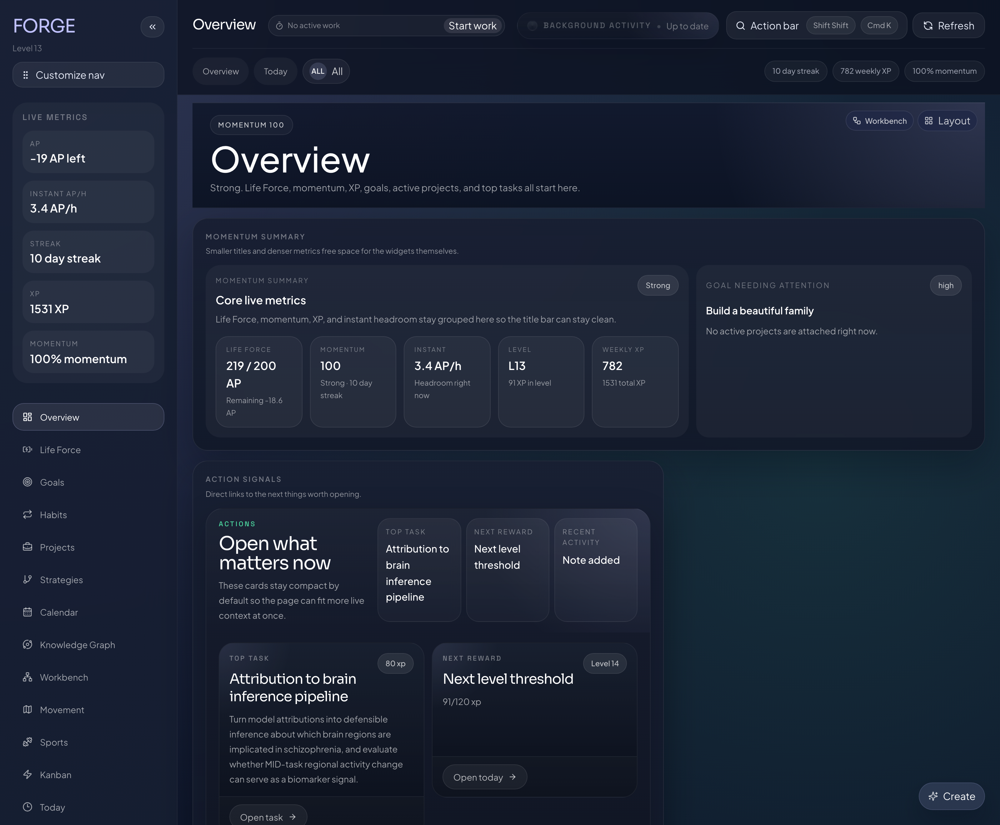
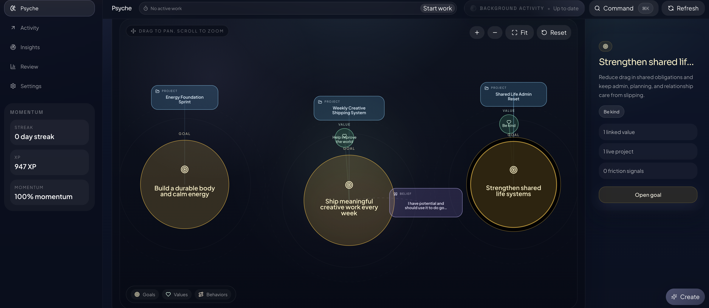

# Forge OpenClaw Plugin

Forge ships a native OpenClaw plugin add-on with a deliberately small public surface.

## Open the UI

If the user wants the actual Forge app, tell them they can either:

- ask the agent to open the Forge UI
- ask the agent to give them the Forge UI address

Useful example replies:

- “I can open the Forge UI for you.”
- “The local Forge UI address is `http://127.0.0.1:4317/forge/`.”

Use the UI route or tool when the user wants visual review, Kanban movement, graph exploration, or broader editing in the Forge app itself.

## Data folder

By default, Forge stores its SQLite data under the active runtime root:

- normal npm/OpenClaw install: usually `~/.openclaw/extensions/forge-openclaw-plugin/data/forge.sqlite`
- linked repo-local plugin install: usually `<repo>/openclaw-plugin/data/forge.sqlite`

If the user wants the data somewhere else for persistence, backup, or manual control, set `dataRoot` in the Forge plugin config and restart the gateway.

## Screenshots

Overview dashboard:



Psyche graph:



The intended workflow is:

- start with `forge_get_operator_overview`, `forge_get_operator_context`, or `forge_get_current_work`
- use `forge_get_psyche_overview`, `forge_get_xp_metrics`, and `forge_get_weekly_review` for read-heavy guidance
- use `forge_search_entities` before mutating when duplicates are possible
- create, update, delete, and restore through the batch entity tools
- use `forge_log_work` for retroactive work
- use the task-run tools for real live work: `forge_start_task_run`, `forge_heartbeat_task_run`, `forge_focus_task_run`, `forge_complete_task_run`, `forge_release_task_run`
- use first-class `note` entities for Markdown progress evidence, handoff context, and multi-entity work summaries
- store agent-authored recommendations with `forge_post_insight`
- use `forge_get_ui_entrypoint` when the user should continue in the visual Forge UI

## Notes contract

Forge notes are the durable collaboration record across the app, API, and plugin surface.

- use `note` as the only collaboration entity name
- use `/api/v1/notes` and the batch entity routes, not legacy comment routes
- notes can link to one or many goals, projects, tasks, and Psyche records
- goal, project, and task creation can include nested `notes`
- task completion, task release, and retroactive work logging can include `closeoutNote`
- the main detail views and the global `/forge/notes` page now surface these records directly in the UI

Some notes can also be pinned to a sub-part of an entity with an anchor key. The main user-facing case today is stage-specific trigger report notes such as Spark, Story, State, Lens, and Pivot.

The execution rule is:

- do not open the Forge UI or a browser just to create or update normal records that the batch entity tools already cover
- only use the UI entrypoint when visual review, multi-record editing, Kanban movement, or Psyche exploration is genuinely the better workflow
- if an entity is only implied in the discussion, do not write immediately; help first, then offer Forge lightly near the end, and only write after explicit save intent

The plugin no longer mirrors every Forge route. Forge itself still has the full `/api/v1` surface for the web app and internal runtime.
Instead, the plugin exposes the parts the agent actually needs: overview, current context, Psyche and XP reads, batch entity mutations, retroactive work logging, real task-run control, insight posting, and UI entry.
When the configured origin is `localhost` or `127.0.0.1`, the plugin auto-starts the bundled Forge runtime. Default localhost installs prefer `4317`, but if that port is already occupied the plugin now moves to the next free local port and remembers it for future runs unless the user explicitly pinned a different port.

## Agent understanding contract

The agent should not have to guess Forge shapes.

The live onboarding route now returns:

- `conceptModel`: what goals, projects, tasks, task runs, insights, and Psyche records actually mean
- `psycheSubmoduleModel`: what values, patterns, behaviors, beliefs, schema catalog entries, modes, mode guides, event types, emotion definitions, and trigger reports are for
- `psycheCoachingPlaybooks`: how the agent should guide pattern analysis, belief/schema intake, mode work, and trigger reports
- `relationshipModel`: how those records relate to each other
- `entityCatalog`: exact per-entity field guides with real route-facing field names, required fields, enums, defaults, and relationship rules
- `toolInputCatalog`: exact input contracts and examples for the mutation and live-work tools

The intended usage is:

1. call `forge_get_agent_onboarding` when tool semantics are uncertain
2. use the exact field names from onboarding
3. do not invent friendlier aliases that the API does not accept

Important examples:

- `belief_entry` uses `statement` and `beliefType`, not ad-hoc fields like `title` or `belief`
- `behavior_pattern` uses `cueContexts`, `shortTermPayoff`, `longTermCost`, and `preferredResponse`
- `mode_guide_session` stores `summary`, `answers`, and `results`, not a free-form note
- `event_type` and `emotion_definition` are reusable Psyche taxonomies that support reports
- `trigger_report` uses nested arrays for `emotions`, `thoughts`, and `behaviors`, plus a structured `consequences` object
- live work is handled through task runs, not just task status

## Which manifest does what

There are three files involved on purpose:

- [`openclaw.plugin.json`](../openclaw.plugin.json): source-of-truth plugin manifest in the main Forge repo
- [`openclaw-plugin/openclaw.plugin.json`](../openclaw-plugin/openclaw.plugin.json): packaged copy that ships in the npm artifact
- [`openclaw-plugin/package.json`](../openclaw-plugin/package.json): npm package metadata and `openclaw.extensions` entry wiring

## Install

Current OpenClaw builds should use package discovery:

```bash
openclaw plugins install forge-openclaw-plugin
openclaw plugins enable forge-openclaw-plugin
node -e 'const fs=require("fs"); const p=process.env.HOME+"/.openclaw/openclaw.json"; const j=JSON.parse(fs.readFileSync(p,"utf8")); j.plugins ??= {}; j.plugins.allow = Array.from(new Set([...(j.plugins.allow || []), "forge-openclaw-plugin"])); fs.writeFileSync(p, JSON.stringify(j, null, 2)+"\n");'
openclaw gateway restart
openclaw forge health
```

For release-parity local development:

```bash
openclaw plugins install ./projects/forge/openclaw-plugin
openclaw plugins enable forge-openclaw-plugin
node -e 'const fs=require("fs"); const p=process.env.HOME+"/.openclaw/openclaw.json"; const j=JSON.parse(fs.readFileSync(p,"utf8")); j.plugins ??= {}; j.plugins.allow = Array.from(new Set([...(j.plugins.allow || []), "forge-openclaw-plugin"])); fs.writeFileSync(p, JSON.stringify(j, null, 2)+"\n");'
openclaw gateway restart
openclaw forge health
```

`openclaw plugins enable forge-openclaw-plugin` sets the enabled flag, but it does not by itself guarantee that `plugins.allow` contains the plugin id. The `node -e ...` command above preserves the current allow list and appends `"forge-openclaw-plugin"` if it is missing.

For older OpenClaw builds that still need the repo-local fallback entry:

```bash
openclaw plugins install ./projects/forge
openclaw gateway restart
```

## Publishing path

For the Forge plugin itself, the safe public distribution path is:

1. publish the npm package `forge-openclaw-plugin`
2. verify install with `openclaw plugins install forge-openclaw-plugin`
3. submit Forge to the OpenClaw community plugin listing with:
   - the npm package name
   - the public GitHub repository
   - install and setup docs

ClawHub clarification:

- the official OpenClaw docs clearly document ClawHub as the public skill registry
- the community plugin listing requirements still point plugin authors to npm and GitHub
- so Forge should be treated as an npm-published OpenClaw plugin first
- if desired, Forge can also ship a separate companion skill to ClawHub for discovery, but that is not the main plugin publish path

## Enable it

Example config:

```json5
{
  plugins: {
    enabled: true,
    allow: ["forge-openclaw-plugin"],
    entries: {
      "forge-openclaw-plugin": {
        enabled: true,
        config: {
          origin: "http://127.0.0.1",
          port: 4317,
          dataRoot: "/absolute/path/to/forge-data",
          apiToken: "",
          actorLabel: "aurel",
          timeoutMs: 15000
        }
      }
    }
  }
}
```

`origin` is the protocol + host without the port.
`port` is split out explicitly so local collisions are easy to fix without rebuilding the whole URL.
`dataRoot` is optional. Use it when you want the local Forge runtime to use a specific data folder instead of the runtime working directory.

Changing the data folder means changing this exact config entry:

```json5
{
  plugins: {
    entries: {
      "forge-openclaw-plugin": {
        config: {
          dataRoot: "/absolute/path/to/forge-data"
        }
      }
    }
  }
}
```

Then restart OpenClaw:

```bash
openclaw gateway restart
```

## Local and remote connection modes

For localhost or Tailscale Forge instances, the plugin can bootstrap an operator session automatically.
For pure localhost targets, it also auto-starts Forge if the local runtime is not already running.

That means the fast path is:

1. install the plugin
2. set `origin` and `port`
3. restart OpenClaw

Examples:

- `origin: "http://127.0.0.1"`, `port: 4317`
- `origin: "http://100.96.75.87"`, `port: 4317`
- `origin: "http://<your-device>.ts.net"`, `port: 4317`

If the target is remote and non-local, use `apiToken`.

## UI entrypoint

The plugin exposes two ways to move the user into the real Forge UI:

- tool: `forge_get_ui_entrypoint`
- redirect route: `GET /forge/v1/ui`

Use this lightly when a visual workflow would be easier, for example:

- reviewing Kanban state
- editing several linked entities
- inspecting Psyche graphs or reports
- continuing work directly inside Forge after the conversation

The hint should stay optional and end-weighted, not pushy.

## Public plugin contract

The curated tool contract is:

- `forge_get_operator_overview`
- `forge_get_operator_context`
- `forge_get_agent_onboarding`
- `forge_get_psyche_overview`
- `forge_get_xp_metrics`
- `forge_get_weekly_review`
- `forge_get_current_work`
- `forge_get_ui_entrypoint`
- `forge_search_entities`
- `forge_create_entities`
- `forge_update_entities`
- `forge_delete_entities`
- `forge_restore_entities`
- `forge_log_work`
- `forge_start_task_run`
- `forge_heartbeat_task_run`
- `forge_focus_task_run`
- `forge_complete_task_run`
- `forge_release_task_run`
- `forge_post_insight`

Live work rule:
- do not fake start or stop work by only moving task status
- use the real task-run tools for active work
- use `forge_log_work` only when the work already happened and you are logging it after the fact

## Exact batch payload rules

The high-level Forge mutation tools are array-first.

`forge_search_entities`:
- pass `searches` as an array

`forge_create_entities`:
- pass `operations` as an array
- each operation must include `entityType` and full `data`
- `entityType` alone is not enough
- batch multiple creates together in one request when they belong to the same user ask

`forge_update_entities`:
- pass `operations` as an array
- each operation must include `entityType`, `id`, and `patch`

`forge_delete_entities`:
- pass `operations` as an array with `entityType` and `id`
- delete defaults to soft unless hard is explicit

`forge_restore_entities`:
- pass `operations` as an array with `entityType` and `id`

## Exact operational payload rules

`forge_log_work`:
- use for work that already happened
- pass either `taskId` or `title`

`forge_start_task_run`:
- required: `taskId`, `actor`
- optional: `timerMode`, `plannedDurationSeconds`, `isCurrent`, `leaseTtlSeconds`, `note`
- if `timerMode` is `planned`, `plannedDurationSeconds` is required

`forge_heartbeat_task_run`:
- required: `taskRunId`
- optional: `actor`, `leaseTtlSeconds`, `note`

`forge_focus_task_run`:
- required: `taskRunId`

`forge_complete_task_run`:
- required: `taskRunId`
- optional: `actor`, `note`

`forge_release_task_run`:
- required: `taskRunId`
- optional: `actor`, `note`

Example create payload:

```json
{
  "operations": [
    {
      "entityType": "goal",
      "data": {
        "title": "Create meaningfully"
      },
      "clientRef": "goal-create-1"
    },
    {
      "entityType": "goal",
      "data": {
        "title": "Build a beautiful family"
      },
      "clientRef": "goal-create-2"
    }
  ]
}
```

Example update payload:

```json
{
  "operations": [
    {
      "entityType": "task",
      "id": "task_123",
      "patch": {
        "status": "focus",
        "priority": "high"
      },
      "clientRef": "task-update-1"
    }
  ]
}
```

Example live-work start payload:

```json
{
  "taskId": "task_123",
  "actor": "aurel",
  "timerMode": "planned",
  "plannedDurationSeconds": 1500,
  "isCurrent": true,
  "leaseTtlSeconds": 900,
  "note": "Starting focused writing block"
}
```

The curated route contract is:

- `GET /forge/v1/health`
- `GET /forge/v1/operator/overview`
- `GET /forge/v1/agents/onboarding`
- `POST /forge/v1/entities/search`
- `POST /forge/v1/entities/create`
- `POST /forge/v1/entities/update`
- `POST /forge/v1/entities/delete`
- `POST /forge/v1/entities/restore`
- `POST /forge/v1/insights`
- `GET /forge/v1/ui`

## Token creation

Best path:

1. open Forge in the browser locally or over Tailscale
2. go to `Settings` -> `Collaboration Settings`
3. issue or rotate a token there
4. copy the raw `fg_live_...` token when it is revealed once
5. paste it into `plugins.entries["forge-openclaw-plugin"].config.apiToken`

CLI path:

```bash
curl -i -c /tmp/forge.cookie http://127.0.0.1:4317/api/v1/auth/operator-session

curl -X POST http://127.0.0.1:4317/api/v1/settings/tokens \
  -b /tmp/forge.cookie \
  -H 'content-type: application/json' \
  -d '{
    "label": "Aurel full operator",
    "agentLabel": "aurel",
    "agentType": "assistant",
    "trustLevel": "trusted",
    "autonomyMode": "scoped_write",
    "approvalMode": "high_impact_only",
    "scopes": [
      "read",
      "write",
      "insights",
      "rewards.manage",
      "psyche.read",
      "psyche.write",
      "psyche.note",
      "psyche.insight",
      "psyche.mode"
    ]
  }'
```

## Diagnose

```bash
openclaw plugins info forge-openclaw-plugin
openclaw forge health
openclaw forge overview
openclaw forge onboarding
openclaw forge ui
openclaw forge start
openclaw forge stop
openclaw forge restart
openclaw forge status
openclaw forge doctor
openclaw forge route-check
```

`openclaw forge doctor` checks connectivity, onboarding, and curated route coverage.
`openclaw forge start`, `openclaw forge stop`, `openclaw forge restart`, and `openclaw forge status` manage the local Forge runtime when it is being handled by the OpenClaw plugin. If Forge was started some other way, they report that instead of killing random local processes.
If the local runtime fails before it becomes healthy, check `~/.openclaw/logs/forge-openclaw-plugin/127.0.0.1-4317.log` for the captured Forge stdout/stderr from the plugin-managed child process. On clean installs, the plugin also attempts to repair missing bundled runtime dependencies on first local start before it launches Forge.
